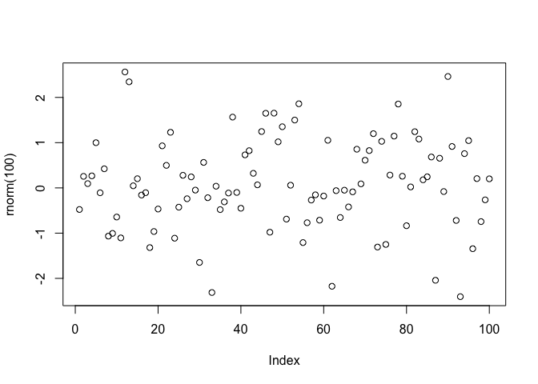

# Microfluidic Single Cells
Niels Hanson  

# Summary

This report summarizes the single-cell/metagenomic analysis of [[@Leung:2012vu]].

# Kernel Densities of GC Content

This is text before the figure.


```r
plot(rnorm(100))
```

 

This is text after the figure.

# Bibliography
