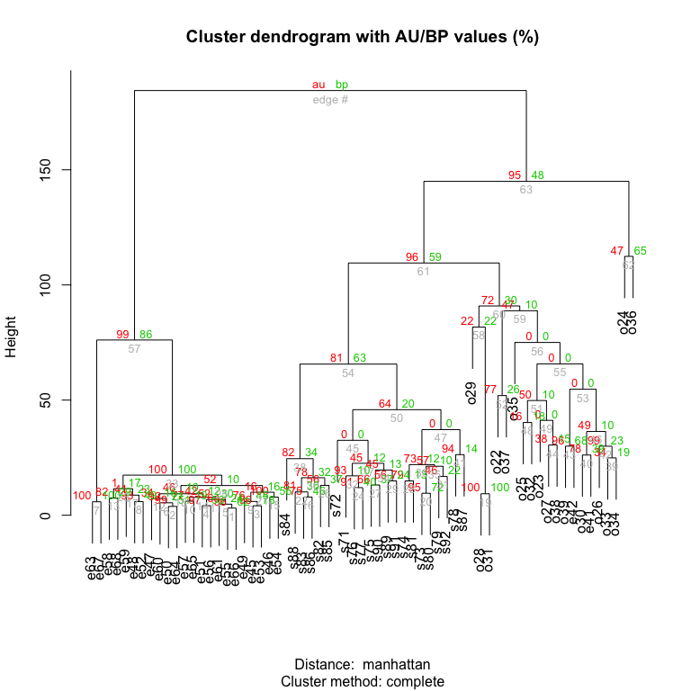

# Microfluidic Single Cells
Niels W. Hanson, Kishori M. Konwar  


# Summary

This report summarizes the single-cell/metagenomic analysis of three different environments, isolate genomes (Environment 1), Oral Microbiome (Environment 2), and a sediment microbiome (Environment 3) [[@Leung:2012vu]]. It consists of Kernal density plot based on GC Content, hierarchical clustering based on taxonomic assignments by the LCA algorithm popularized in MEGAN [[@Huson:2007jl]], and a comparison of relative taxonomic abundance via three different taxonomic estimation methods: eggNOG [[@Jensen:2007cc]], MEGAN [[@Huson:2007jl]], and MLTreeMap [[@Stark:2010hg]].

## Files

This analysis consists of the following files in the [data/]() folder:

* [LBL_GC_Content_Env.txt.gz](): GC content percentages for each read in each of the environments.
* [dendrogram_table_minus_control.csv.gz](): Table of relative taxonomic MEGAN assignments based on a blastx using the RefSeq database.
* [environment_taxa.txt.gz](): Long-table of taxnomic assignments for each sample using eggNOG, MEGAN (RefSeq), and MLTreeMap.

# Analysis

Here we go though the particulars of the analysis.

## Required Libraries

Load required libraries.


```r
library("lattice")
library("gplots")
library("dplyr")
library("reshape2")
library("pvclust")
```

## Kernel Densities of GC Content

Load the GC data.


```r
all_gc <- read.table(paste(wd,"data/LBL_GC_Content_Env.txt.gz", sep=""), header=TRUE, sep = "\t")
head(all_gc)
```

```
##      GC samp  name   Environment
## 1 48.95   21 SCG21 Environment 3
## 2 54.04   21 SCG21 Environment 3
## 3 49.63   21 SCG21 Environment 3
## 4 51.44   21 SCG21 Environment 3
## 5 52.19   21 SCG21 Environment 3
## 6 53.01   21 SCG21 Environment 3
```

Print plots for each environment.


```r
densityplot(~ GC | name, subset(all_gc, Environment=="Environment 1"), 
                         plot.points = FALSE, xlab="GC Content (Percent)", 
                         ylab="Density", 
                         col="red")
```

 


```r
densityplot(~ GC | name, subset(all_gc, Environment=="Environment 2"), 
                         plot.points = FALSE, xlab="GC Content (Percent)", 
                         ylab="Density", 
                         col="blue")
```

 


```r
densityplot(~ GC | name, subset(all_gc, Environment=="Environment 3"), 
                         plot.points = FALSE, xlab="GC Content (Percent)", 
                         ylab="Density", 
                         col="dark green")
```

 


```r
densityplot(~ GC|Environment, all_gc, 
            groups=name, 
            plot.points = FALSE, 
            xlab="GC Content (Percent)", 
            ylab="Density", main="% GC Content by Environment",  
            panel = function(..., col) panel.densityplot(..., col = c("dark grey","red","blue","dark green")[packet.number()]), 
            layout=c(4,1))
```

 

## Hierarchical Clustering

Basic hierarchical clustering based on MEGAN taxonomic estimates.


```r
dendro_table <- read.csv(paste(wd, "data/dendrogram_table_minus_control.csv.gz", sep=""), header=T, row.names=1)
# dendro_table <- dendro_table[, !(names(dendro_table) %in% c("e62", "o21", "e40"))]
tree <-pvclust(dendro_table, method.hclust="complete", method.dist="manhattan", nboot=10)
```

```
## Bootstrap (r = 0.5)... Done.
## Bootstrap (r = 0.6)... Done.
## Bootstrap (r = 0.7)... Done.
## Bootstrap (r = 0.8)... Done.
## Bootstrap (r = 0.9)... Done.
## Bootstrap (r = 1.0)... Done.
## Bootstrap (r = 1.1)... Done.
## Bootstrap (r = 1.2)... Done.
## Bootstrap (r = 1.3)... Done.
## Bootstrap (r = 1.4)... Done.
```

```r
plot(tree)
```

 

## Taxonomic Barplots


```r
env_taxa_df <- read.table(paste(wd,"data/environment_taxa.txt.gz", sep=""), header=TRUE, sep="\t")
env_taxa_df$species <- factor(env_taxa_df$species,levels=rev(unique(env_taxa_df$species)))
```

Plot each of the bar plots.


```r
barchart(species ~ corrected | samp,
        groups=method,
        data=subset(env_taxa_df, environment=="Environment 1"),
        stack = TRUE,
        horizontal = TRUE,
        xlab="Percent Read Assignment",
        main="Taxa Found in Environment 1",
        auto.key=TRUE)
```

 


```r
barchart(species ~ corrected | samp,
        groups=method,
        data=subset(env_taxa_df, environment=="Environment 2"),
        stack = TRUE,
        horizontal = TRUE,
        xlab="Percent Read Assignment",
        main="Taxa Found in Environment 2",
        auto.key=TRUE)
```

 


```r
barchart(species ~ corrected | samp,
        groups=method,
        data=subset(env_taxa_df, environment=="Environment 3"),
        stack = TRUE,
        horizontal = TRUE,
        xlab="Percent Read Assignment",
        main="Taxa Found in Environment 3",
        auto.key=TRUE)
```

 

Transform into  into percent. Also remove estimates that are not corroborated by at least one other taxonomic estimation method and make up less than 


```r
res <- select(env_taxa_df, species, corrected, method, environment) %>%
       group_by(environment) %>%
       mutate(percent=corrected*100/sum(corrected))

res2 <- group_by(res, environment, method, species) %>%
        summarize(count=sum(percent))

res3 <- select(res2, species, count, method, environment) %>%
       group_by(species, environment) %>%
       mutate(count_method=sum(count > 0)) %>%
       filter(count >=2.5 )
```


```r
barchart(species ~ count | environment,
        groups=method,
        data=res3,
        stack = TRUE,
        horizontal = TRUE,
        layout = c(3,1),
        xlab="Percent Read Assignment",
        auto.key=TRUE)
```

 

# Bibliography
